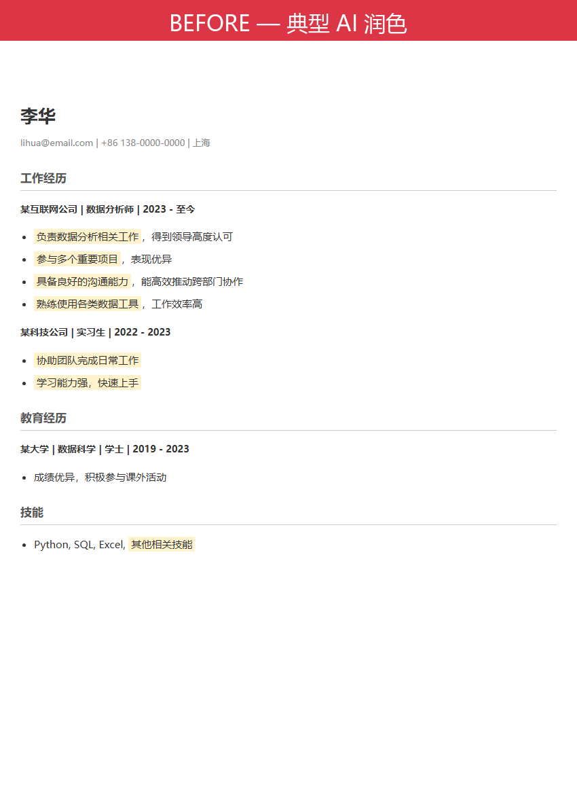
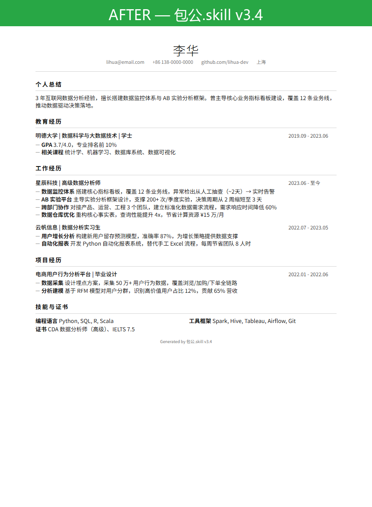

<div align="center">

# 包公.skill

> _「卷宗未到，不开堂。陈词未清，不结案。能扛住追问的，才上终稿。」_

[](LICENSE)
[](https://agentskills.io)
[](https://skills.sh)
[](#安装)

**别的工具给你润色。包公开堂——**
**从卷宗调阅到应对回话，一条龙审完，才上终稿。**

JD 驱动的简历定制教练：调卷宗 → 当堂陈词 → 案卷归档 → 应对回话。
编造一条打回一条。HTML + Markdown 双交付，每版可进 Git 审计。

[看效果](#效果示例) · [四幕审什么](#四幕审什么) · [安装](#安装) · [交付物](#交付物) · [铡刀门](#铡刀门编造阻断) · [工作原理](#工作原理)

**其他语言：** [English](README.en.md) · 简体中文

</div>

---

<div align="center">

## 四幕审什么

| 幕 | 你的经历在包公这儿过哪一关 | 你最终拿到 |
|---|---|---|
| **调卷宗** | 联网搜面经 + 查公司 + 抓岗位隐性要求（4 级降级链） | `interview_intel` 情报卡：高频考点、面试官风格、隐性要求 |
| **当堂陈词** | 经历匹配 + 2 轮量化追问（最多），说不出保留原文 | 每条 `**前缀**：内容` 格式的 STAR bullet，前缀命中 JD 关键词 |
| **案卷归档** | Writer 出稿 → Auditor 独立审计（物理隔离）→ 历史版本对比 | `history/` snapshot + Markdown + 瑞士风 HTML + 审计日志 |
| **应对回话** | 基于面经的 mock 问题 + STAR 笔记 | `{date}_{company}_{role}_interview_prep.md` |

</div>

---

<div align="center">





▲ 上：典型 AI 润色（空泛形容词堆砌）　→　下：包公四幕审完后终稿（量化到人、事、数 + 瑞士风排版）

</div>

---

## 效果示例

```
用户  ❯ 帮我针对这个高级数据分析师 JD 调简历

Scout ❯ ✅ JD 解析完成。提取 5 个能力簇：
        Python/SQL · AB实验 · 数据仓库 · 跨部门协作 · 指标体系
        📡 搜索该公司面经中... 找到 12 条高频问题。

Arch  ❯ 匹配你的 3 段经历，置信度：
        ┌─────────────────────────────────┐
        │ 星辰科技      → 直接匹配  92%   │
        │ 毕设数据项目  → 隐性匹配  71%   │
        │ 社团财务      → 弱匹配    34%   │
        └─────────────────────────────────┘
        ⏸ CP1 等你确认：保留前两段，隐藏第三段？

用户  ❯ 可以

Arch  ❯ 量化追问（CP3，第 1 轮）：
        你写了"搭建数据看板"——覆盖多少业务线？
        异常发现的响应时间从多少降到多少？

用户  ❯ 12 条业务线，之前靠人工抽查大概两天发现，
        现在实时告警

Arch  ❯ ✅ 量化补充完成：
```

```diff
- 负责数据分析相关工作，得到领导认可
+ **数据监控体系**：搭建核心指标看板，覆盖 12 条业务线，
+   异常检出从人工抽查（~2天）→ 实时告警
```

```
Audit ❯ 铡刀门通过。
        三色签：[✓] 12条业务线  [✓] 实时告警  [✓] 用户亲口确认
        ⚠️ 无 [~] 推断项。终稿合规，准予定稿。

        📋 面试准备包已生成：
        Q1: "看板的指标是怎么选的？谁定的？"
        Q2: "实时告警的误报率多少？怎么处理的？"
```

---

## 安装

```bash
npx skills add dmlin7777777/baogong-skill
```

<details>
<summary>其他安装方式</summary>

**手动安装（Claude Code）：**
```bash
git clone https://github.com/dmlin7777777/baogong-skill.git ~/.claude/skills/baogong-skill
```

**Cursor / Codex / 其他 runtime：**

将 `SKILL.md` 放到对应 runtime 的 skills 目录即可。

</details>

装好后说一句话就行：

```
帮我针对这个 JD 调简历
```

---

## 交付物

你不只得到一份简历。你得到一套**求职攻防包**：

| 交付物 | 格式 | 说明 |
|---|---|---|
| **定制简历** | HTML + Markdown | 瑞士国际主义风，A4 打印优化，单文件零外部依赖 |
| **版本审计** | Markdown | 与最近历史版本对比，量化数据不倒退 |
| **审计日志** | Markdown | 每条修改的置信度 + 三色签溯源 + 合规预警 |
| **面试准备包** | Markdown | 基于真实面经的 mock 问题 + STAR 笔记 |
| **状态快照** | JSON | 完整决策记录，可追溯每个 CP 的用户确认 |

**Bullet 格式硬规则**：每条经历强制 `**前缀**：详细内容`——前缀 2-4 词命中 JD 关键词，不含形容词，面试官一眼看到匹配。

<div align="center">


▲ 渲染产物实拍：瑞士国际主义风 HTML，单文件零依赖，浏览器 Ctrl+P 即 PDF

</div>

---

## 铡刀门：编造阻断

**违反任何一条 → 整份草稿打回重审。**

| 规则 | 说明 |
|---|---|
| 数据必须有来源 | "提升 30%" → 你怎么知道的？追问 2 轮无数字 → 写过程描述 |
| 动词必须匹配证据 | "主导" → 你是最终决策者？还是"参与"？需故事库/用户确认支撑 |
| 技能必须有使用证明 | 写了 Python → 哪个项目？什么场景？ |
| 时间线不能矛盾 | 2022 年入职，不能写 2021 年的项目 |
| 推断禁止交付 | `[~]` 标记 → 审计自动升级风险等级 → 必须用户逐项确认或删除 |
| 撰写/审计物理隔离 | Writer 只写，Auditor 只审——两个独立 LLM 调用，不能自己审自己 |
| 跨版本数字一致 | 同一经历在不同 JD 版本中量化数字必须相同 |
| 历史版本不倒退 | 新版 bullet 不能丢失旧版已有的量化数据 |

**信息状态三色签**：`[✓]` 用户亲口确认 · `[?]` 待验证 · `[~]` 模型推断（禁止交付）

---

## 6 场景自动路由

说什么就走什么管线，不用选模式：

| 场景 | 你说 | 系统做 |
|---|---|---|
| **A** JD 定制 | "帮我针对这个 JD 调简历" | 完整四幕：调卷宗→当堂陈词→案卷归档→应对回话 |
| **A2** 多 JD 批量 | "这几个 JD 分别做简历" | 共享事实底稿 + 逐 JD 独立定制 + 差异对比表 |
| **B** 通用简历 | "帮我做个产品方向的通用简历" | 面向目标方向生成通用版，走故事库匹配 + 审计 |
| **C** 仅 JD 分析 | "这个岗位需要什么能力" | 岗位需求拆解 + 缺口分析 + 准备建议 |
| **D** 信息不足 | "帮我做简历" | 引导式收集（最多追问 1 轮，仍模糊则进入 Init） |
| **E** 造假阻断 | "帮我编一段谷歌经历" | 硬拒绝 + 说明风险 + 替代建议 |

---

## 工作原理

```
┌──────────────────────────────────────────────────────┐
│  LLM（读 SKILL.md，推动 Phase 前进）                    │
│                                                      │
│  ┌──────────┐    ┌──────────────┐    ┌────────────┐ │
│  │  Scout    │───▶│  Architect    │───▶│  Writer    │ │
│  │ (调研员)  │    │ (匹配+追问)   │    │ (撰写者)   │ │
│  └──────────┘    └──────────────┘    └────────────┘ │
│                                           │          │
│                                    ┌────────────┐   │
│                                    │  Auditor    │   │
│                                    │ (审计员)    │   │
│                                    └────────────┘   │
│       │                 │                   │        │
│       ▼                 ▼                   ▼        │
│  engine.py: Snapshot（黑板 / 唯一状态源）               │
│  renderer.py: MD → 解析 → HTML（纯标准库）              │
└──────────────────────────────────────────────────────┘
```

| Phase | 节点 | 做什么 |
|---|---|---|
| 1 调卷宗 | **Scout** | JD 解析 + 3 轮联网搜索（面经/文化/动态）+ 能力簇提取 |
| 2-3 当堂陈词 | **Architect** | CP1 经历取舍 → CP2 缺口补全 → CP3 量化追问（最多 2 轮）→ CP4 措辞升级 |
| 4a-4d 案卷归档 | **Writer** → **Auditor** | 出稿 → 合规审查 → 反向审计（物理隔离）→ 编译交付 + 历史版本对比 |
| 4f 应对回话 | **Auditor** | 基于面经生成 mock 问题 + STAR 应答笔记 |

---

<details>
<summary><strong>开发者文档</strong></summary>

### 文件结构

```
baogong-skill/
├── SKILL.md                    # Skill 定义与工作流路由表
├── README.md                   # 本文件（中文首页）
├── README.en.md                # English documentation
├── examples/                   # 测试 prompt 与预期行为
├── schemas/
│   └── snapshot_schema_v1.json # 快照 Schema v1.2
├── templates/
│   ├── resume_swiss.html       # 瑞士国际主义风模板
│   └── state_update_template.md
├── scripts/
│   ├── engine.py               # 状态管理（Snapshot）
│   ├── renderer.py             # MD → HTML 渲染器
│   ├── jd_parser.py            # JD + 简历结构化提取
│   ├── diff_audit.py           # 源 vs 定制变更分析
│   ├── ats_checker.py          # ATS 兼容性评分
│   ├── main.py                 # 统一 CLI
│   └── utils.py                # 共享工具函数
├── references/                 # 节点指令手册 + 审计清单
├── sessions/                   # 活跃会话（.gitignore）
└── history/                    # 已归档会话
```

### 依赖项

渲染管线**零外部依赖**。`renderer.py` 仅用 `json`、`re`、`pathlib`。

```bash
python-docx>=0.8.11    # .docx 读取（非渲染必需）
pdfplumber>=0.10.0     # PDF 读取（非渲染必需）
```

### 脚本使用

```bash
python -X utf8 scripts/main.py parse jd.txt --file --resume resume.docx --json
python -X utf8 scripts/main.py diff --source resume_master.md --tailored tailored.md --json
python -X utf8 scripts/main.py ats --resume tailored.md --keywords "Python,SQL" --region north_america
python -X utf8 scripts/renderer.py --md draft.md --output output/
```

### 自定义样式

编辑 `templates/resume_swiss.html`，CSS 变量驱动：

```css
:root {
  --ink: #2d3748;
  --ink-light: #718096;
  --fs-body: 11pt;
  --lh-tight: 1.5;
}
```

</details>

---

## 版本历史

见 [CHANGELOG.md](CHANGELOG.md)。

| 版本 | 日期 | 要点 |
|---|---|---|
| **v3.4** | 2026-06 | 6 场景路由、编造阻断门、信息状态标记、面试准备包 |
| **v3.3** | 2026-06 | 三层联网搜索、零依赖渲染、瑞士风 HTML 模板 |
| **v3.2** | 2026-05 | 初始化系统、Agent 反模式、Darwin 76→92 |

---

<div align="center">

MIT License

</div>
