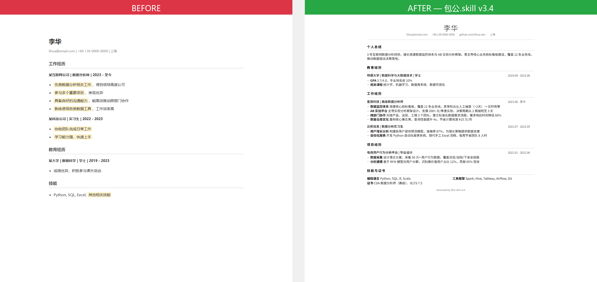
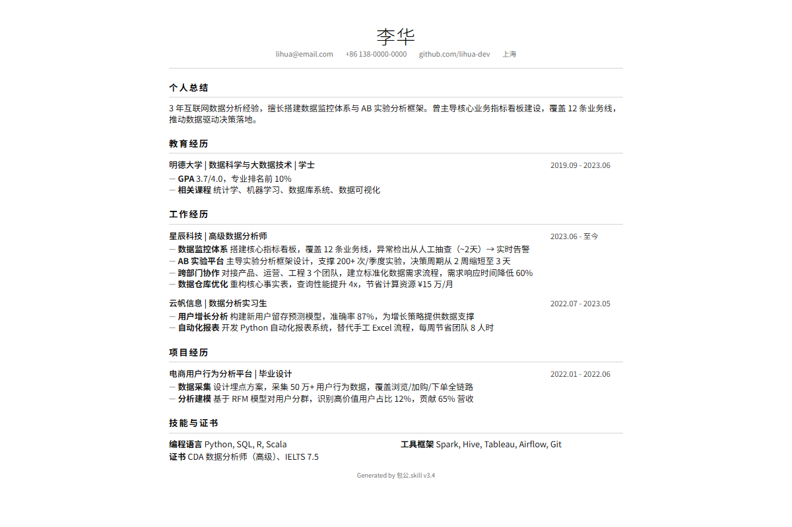

<div align="center">

# 包公.skill

> _「每一条经历，都要过堂。过不了的，打回重写。」_

[](LICENSE)
[](https://agentskills.io)
[](https://skills.sh)
[](#安装)

**别的工具帮你润色。包公帮你过堂——能扛住追问的，才上终稿。**

铁面审计型求职教练。针对 JD 交互式定制简历，编造一条打回一条。HTML + Markdown 双交付。

[看效果](#效果示例) · [安装](#安装) · [交付什么](#交付物) · [铡刀门](#铡刀门编造阻断) · [工作原理](#工作原理)

**其他语言：** [English](README.en.md) · 简体中文

</div>

---

<div align="center">



▲ 左：典型 AI 润色（空泛形容词堆砌）　→　右：过堂后终稿（量化到人、事、数 + 瑞士风排版）

</div>

---

## 效果示例

```
用户  ❯ 帮我针对这个高级数据分析师 JD 调简历

Scout ❯ ✅ JD 解析完成。提取 5 个能力簇：
        Python/SQL · AB实验 · 数据仓库 · 跨部门协作 · 指标体系
        📡 搜索该公司面经中... 找到 12 条高频问题。

Arch  ❯ 匹配你的 3 段经历，置信度：
        ┌─────────────────────────────────┐
        │ 星辰科技      → 直接匹配  92%   │
        │ 毕设数据项目  → 隐性匹配  71%   │
        │ 社团财务      → 弱匹配    34%   │
        └─────────────────────────────────┘
        ⏸ CP1 等你确认：保留前两段，隐藏第三段？

用户  ❯ 可以

Arch  ❯ 量化追问（CP3，第 1 轮）：
        你写了"搭建数据看板"——覆盖多少业务线？
        异常发现的响应时间从多少降到多少？

用户  ❯ 12 条业务线，之前靠人工抽查大概两天发现，
        现在实时告警

Arch  ❯ ✅ 量化补充完成：
```

```diff
- 负责数据分析相关工作，得到领导认可
+ **数据监控体系**：搭建核心指标看板，覆盖 12 条业务线，
+   异常检出从人工抽查（~2天）→ 实时告警
```

```
Audit ❯ 铡刀门 10/10 通过。
        三色签：[✓] 12条业务线  [✓] 实时告警  [✓] 用户亲口确认
        ⚠️ 无 [~] 推断项。终稿合规，准予定稿。

        📋 面试准备包已生成：
        Q1: "看板的指标是怎么选的？谁定的？"
        Q2: "实时告警的误报率多少？怎么处理的？"
```

---

## 安装

```bash
npx skills add dmlin7777777/baogong-skill
```

<details>
<summary>其他安装方式</summary>

**手动安装（Claude Code）：**
```bash
git clone https://github.com/dmlin7777777/baogong-skill.git ~/.claude/skills/baogong-skill
```

**Cursor / Codex / 其他 runtime：**

将 `SKILL.md` 放到对应 runtime 的 skills 目录即可。

</details>

装好后说一句话就行：

```
帮我针对这个 JD 调简历
```

升堂 → 过堂 → 断案 → 定稿，全自动。

---

## 交付物

你不只得到一份简历。你得到一套**求职攻防包**：

| 交付物 | 格式 | 说明 |
|---|---|---|
| **定制简历** | HTML + Markdown | 瑞士国际主义风，A4 打印优化，单文件零外部依赖 |
| **审计日志** | Markdown | 每条修改的置信度 + 缺口标记 + 合规预警 |
| **面试准备包** | Markdown | 基于真实面经的 mock 问题 + STAR 笔记 |

**Bullet 格式硬规则**：每条经历强制 `**前缀**: 详细内容`——前缀命中 JD 关键词，面试官一眼看到匹配。

<div align="center">



▲ 渲染产物实拍：瑞士国际主义风 HTML，单文件零依赖，浏览器 Ctrl+P 即 PDF

</div>

---

## 铡刀门：编造阻断

**10 条铁律。违反任何一条 → 整份草稿打回重审。**

| 规则 | 说明 |
|---|---|
| 数据必须有来源 | "提升 30%" → 你怎么知道的？ |
| 动词必须匹配证据 | "主导" → 你是最终决策者？还是"参与"？ |
| 技能必须有使用证明 | 写了 Python → 哪个项目？什么场景？ |
| 时间线不能矛盾 | 2022 年入职，不能写 2021 年的项目 |
| 推断禁止交付 | `[~]` 标记 → 自动升级审计 → 禁止出现在终稿 |

**信息状态三色签**：`[✓]` 用户亲口确认 · `[?]` 待验证 · `[~]` 模型推断（禁止交付）

> 量化追问最多 2 轮。说不出来？保留原文。**包公不编数字。**

---

## 凭什么不同

|  | 包公.skill | 通用 AI 问答 | SaaS (Jobscan 等) |
|---|---|---|---|
| **铡刀门** | 10 条铁律 + 整稿打回 | 无 | 无 |
| **信息溯源** | `[✓]` / `[?]` / `[~]` 三色签 | 无 | 无 |
| **审计隔离** | 撰写 / 审计 物理隔离（不能自己审自己） | 自我审计 | 无审计 |
| **面试准备** | 基于真实面经 | 通用模板 | 无 |
| **量化引导** | 2 轮递进追问，说不出保留原文 | 直接编数字 | 仅关键词 |
| **文化适配** | 北美自信 → 东亚协同 → 北欧谦逊 | 无 | 部分 |
| **依赖** | 零（纯 Python 标准库） | N/A | 付费 SaaS |

---

## 6 场景自动路由

说什么就走什么管线，不用选模式：

| 场景 | 你说 | 系统做 |
|---|---|---|
| **A** JD + 简历 | "帮我针对这个 JD 调简历" | 完整管线：调研→匹配→审计→渲染 |
| **A2** 多 JD | "这几个 JD 分别做简历" | 共享事实库 + 逐 JD 定制 |
| **B** 仅简历 | "帮我优化简历" | 故事库打磨，无 JD 匹配 |
| **C** 仅 JD | "这个岗位需要什么能力" | 缺口分析 + 准备建议 |
| **D** 信息不足 | "帮我做简历" | 引导式收集 |
| **E** 造假请求 | "帮我编一段谷歌经历" | 硬拒绝 + 替代建议 |

---

## 包公立规

<table>
<tr><td>

**铁面拒绝**
- 编造你没做过的事
- 夸大你的角色
- 添加你不会的技能
- 擅自发送简历
- 删除你的原始文件

</td><td>

**停堂等你确认**
1. 公司/地区确认
2. 经历取舍（CP1）
3. 内容缺口补全（CP2）
4. 量化追问（CP3，最多 2 轮）
5. 措辞升级（CP4）

</td></tr>
</table>

---

## 工作原理

```
┌──────────────────────────────────────────────────────┐
│  LLM（读 SKILL.md，推动 Phase 前进）                    │
│                                                      │
│  ┌──────────┐    ┌──────────────┐    ┌────────────┐ │
│  │  Scout    │───▶│  Architect    │───▶│  Auditor   │ │
│  │ (调研员)  │    │  (撰写者x2)   │    │ (审计员)   │ │
│  └──────────┘    └──────────────┘    └────────────┘ │
│       │                 │                   │        │
│       ▼                 ▼                   ▼        │
│  engine.py: Snapshot（黑板 / 唯一状态源）               │
│  renderer.py: MD → 解析 → HTML（纯标准库）              │
└──────────────────────────────────────────────────────┘
```

| 阶段 | 节点 | 做什么 | 你的角色 |
|---|---|---|---|
| 升堂 | **Scout** | JD 解析 + 公司调研 + 面经搜索（4 级降级链） | 审阅确认 |
| 过堂 | **Architect** | 匹配 + 量化追问（最多 2 轮，说不出就保留原文） | 确认或否决 |
| 断案 | **Auditor** | 铡刀门 10 条铁律 + 面试官挑战 + 合规检查 | 最终审阅 |
| 定稿 | **Renderer** | MD → 瑞士国际主义风 HTML，零依赖 | 接收交付 |

---

<details>
<summary><strong>开发者文档</strong></summary>

### 文件结构

```
baogong-skill/
├── SKILL.md                    # Skill 定义与工作流路由表
├── README.md                   # 本文件（中文首页）
├── README.en.md                # English documentation
├── examples/                   # 测试 prompt 与预期行为
├── schemas/
│   └── snapshot_schema_v1.json # 快照 Schema v1.2
├── templates/
│   ├── resume_swiss.html       # 瑞士国际主义风模板
│   └── state_update_template.md
├── scripts/
│   ├── engine.py               # 状态管理（Snapshot）
│   ├── renderer.py             # MD → HTML 渲染器
│   ├── jd_parser.py            # JD + 简历结构化提取
│   ├── diff_audit.py           # 源 vs 定制变更分析
│   ├── ats_checker.py          # ATS 兼容性评分
│   ├── main.py                 # 统一 CLI
│   └── utils.py                # 共享工具函数
├── references/                 # 节点指令手册 + 审计清单
├── sessions/                   # 活跃会话（.gitignore）
└── history/                    # 已归档会话
```

### 依赖项

渲染管线**零外部依赖**。`renderer.py` 仅用 `json`、`re`、`pathlib`。

```bash
python-docx>=0.8.11    # .docx 读取（非渲染必需）
pdfplumber>=0.10.0     # PDF 读取（非渲染必需）
```

### 脚本使用

```bash
python -X utf8 scripts/main.py parse jd.txt --file --resume resume.docx --json
python -X utf8 scripts/main.py diff --source resume_master.md --tailored tailored.md --json
python -X utf8 scripts/main.py ats --resume tailored.md --keywords "Python,SQL" --region north_america
python -X utf8 scripts/renderer.py --md draft.md --output output/
```

### 自定义样式

编辑 `templates/resume_swiss.html`，CSS 变量驱动：

```css
:root {
  --ink: #2d3748;
  --ink-light: #718096;
  --fs-body: 11pt;
  --lh-tight: 1.5;
}
```

</details>

---

## 版本历史

见 [CHANGELOG.md](CHANGELOG.md)。

| 版本 | 日期 | 要点 |
|---|---|---|
| **v3.4** | 2026-06 | 6 场景路由、编造阻断门、信息状态标记、面试准备包 |
| **v3.3** | 2026-06 | 三层联网搜索、零依赖渲染、瑞士风 HTML 模板 |
| **v3.2** | 2026-05 | 初始化系统、Agent 反模式、Darwin 76→92 |

---

<div align="center">

MIT License

</div>
